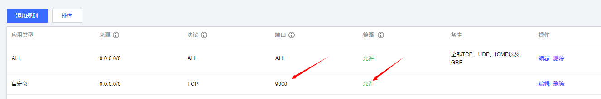
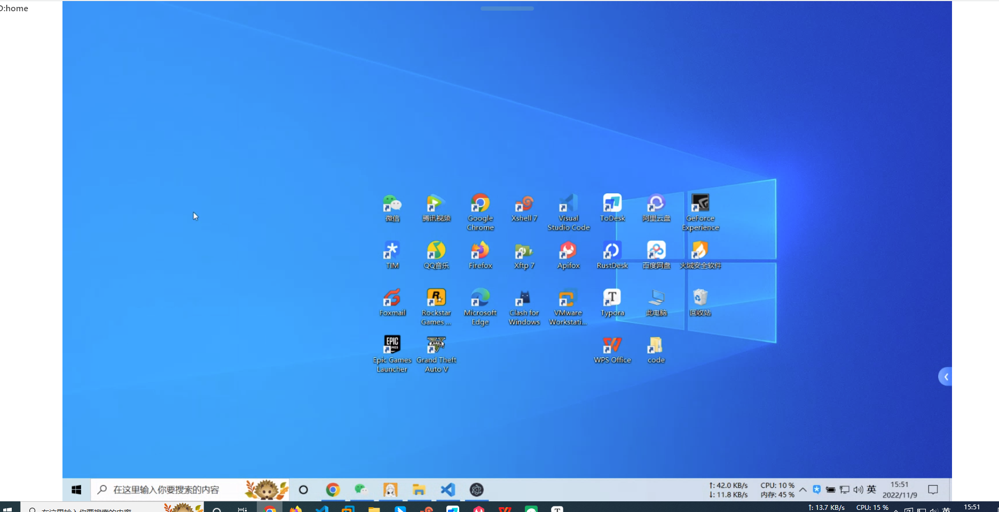

# WebDesk使用文档

**web文件夹是web端代码，desk文件夹是PC端应用代码**

## 1. 部署信令服务器

部署前服务器需安装[docker](https://docs.docker.com/engine/install/)
服务器端使用[peerjs-server](https://github.com/peers/peerjs-server)
建议docker部署
1、 docker run -p 9000:9000 -d peerjs/peerjs-server
2、服务器开放9000端口



## 2.部署WebDesk   web 端页面

将前端页面打包好后在服务器使用express部署

```
sudo apt-get update
sudo apt-get install nodejs npm 
mkdir webdesk
cd webdesk
npm init
npm install express --save
git clond xxxxxx
sudo node index.js
```


## 3. 被控端安装软件

被控端需要安装软件，注意，每个被控端的id不能一样

## 4. 使用

1、 进入页面后点击底部半透明圆条，此时会弹出工具窗口


2、 工具窗口出现后在输入框中输入远程计算机ID(需提前安装WebDesk软件)，然后点击连接


3、 ，再等待几秒屏幕出现画面即可进行远程控制，此时点击屏幕其他位置可关闭工具窗口，点击断开即可断开连接


